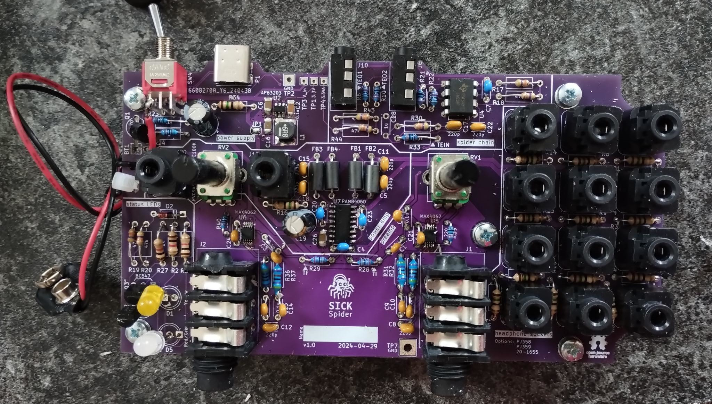

# SICK Spider
A new board design for the amazing [COATI Spider project](https://coati.pimienta.org/electronics/spider/), a small portable device for simultaneous interpretation.

## Changes compared to the COATI spider
- way less noise
- battery level indicator
- better gain control range
- USB-C port for power supply
- way longer battery runtime (8-50h)
- easier available components

## Costs
- roughly 40€ for a new spider and 20€ for an upgrade board.
- An existing COATI spider case can be reused, only one additional cutout for the USB-C port is required.

## Documents & How-To's

#### Version 1.1 (Documents work in progress)
- [Changelog](./CHANGELOG.md)
- Ordering
  * [Parts list](https://pad.kanthaus.online/sick-spider-parts-list?view)
  * Gerber files: [JLCPCB](https://alangecker.github.io/sick-spider/output/1.1c/JLCPCB/spider2-JLCPCB.zip)
- Building instructions
    * [Part 1: soldering “SMD” components](https://pad.kanthaus.online/sick-spider-instructions-part1?view)
    * [Part 2: soldering "trough hole" components](https://pad.kanthaus.online/sick-spider-instructions-part2?view)
    * [Part 3: building the case](https://pad.kanthaus.online/sick-spider-instructions-part3?view)
- [Debugging](https://pad.kanthaus.online/sick-spider-instructions-debugging?view)
- [Boardview and BOM](https://alangecker.github.io/sick-spider/output/1.1c/spider2-ibom.html)
- [Schematic](https://alangecker.github.io/sick-spider/output/1.1c/spider2-schematic.pdf)

#### Version 1.0
- Ordering
  * [Parts list](./docs/v1.0/partslist.md)
  * Gerber files: [JLCPCB](https://alangecker.github.io/sick-spider/output/1.0/JLCPCB/spider2-JLCPCB.zip)
- Building instructions
    * [Part 1: soldering “SMD” components](./docs/v1.0/part1-smd.md)
    * [Part 2: soldering "trough hole" components](./docs/v1.0/part2-throughhole.md)
    * [Part 3: building the case](https://pad.kanthaus.online/sick-spider-instructions-part3?view)
- [Debugging](./docs/v1.0/debugging.md)
- [Boardview and BOM](https://alangecker.github.io/sick-spider/output/1.0/spider2-ibom.html)
- [Schematic](https://alangecker.github.io/sick-spider/output/1.0/spider2-schematic.pdf)

## License
GPLv3 (=open source♥)