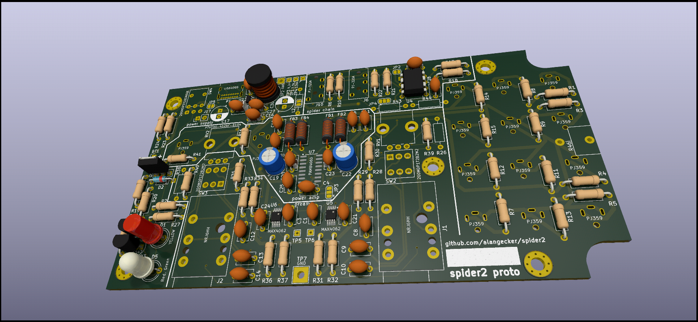

# Spider2
A new board design for the amazing [COATI Spider project](https://coati.pimienta.org/electronics/spider/), a small portable device for simultaneous interpretation.

# Redesign Goals
- way less noise
    * avoid interferences from radios and other channel
    * balanced microphone inputs
    * filtered power from AC power supply
    * PCB with a groundplane for less
- Modern and better available components
- Some battery level indicator
- better gain control range
- In-place replacement in the same case

# Status
First prototype works beautifully except some radio interferences. Second prototype board with hopefully much better EMI (Electromagnetic interference) characteristics is on the way. if this is good enough, this version will be the 1.0 and built in series :)

# Outlook
- Around 40€ for a new spider and 20€ for an upgrade board (reusing some of the old parts)
- Only one new cutout in the case to be made for an upgrade (-> USB-C Port for charging/powerbank ♥)
- 8-40h of battery runtime
- There should be no noticeable noise at all :) (when used with an XLR to stereo jack microphone cable for "balanced" audio)
- A few components are more difficult to solder ("SMD"), as many modern chips are no longer available in large size ("trough hole")

# Documents
| Revision          | Documents
|-------------------|-------------------|
| 0.2-prototype | [BOM & Boardview](https://alangecker.github.io/sick-spider/output/0.2-prototype/spider2-ibom.html), [Schematic]((https://alangecker.github.io/sick-spider/output/0.2-prototype/spider2-schematic.pdf)
| 0.1-prototype | [BOM & Boardview](https://alangecker.github.io/sick-spider/output/0.1-prototype/spider2-ibom.html), [Schematic]((https://alangecker.github.io/sick-spider/output/0.1-prototype/spider2-schematic.pdf)

# License
GPLv3 (=open source)